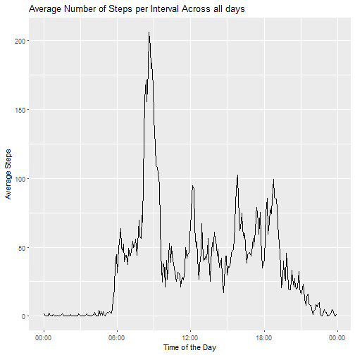
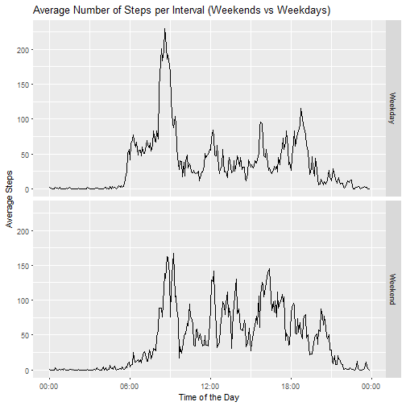

## Loading and preprocessing the data

First, load up the libraries.


```r
require("dplyr")      # For some table operations.
require("ggplot2")    # for ggplots preferred.
require("scales")
```

Now, begin by unzipping the activity.zip file and optionally overwriting output.
Then, read in the file to variable -> activity_df.


```r
unzip("activity.zip" , exdir=".")
activity_df <- tbl_df(read.csv("activity.csv"))
```

Next we should simply clean the available data for the rest of the assignment.


```r
# Add time associated with the "interval" vector.
#  There will be some minor errors in scaling due to time difference 
#  ie. 855 and 900 are not 45 "minutes apart" this step fixes it.
activity_df$time <- with( 
                      activity_df,
                      substr(
                        as.POSIXct(
                          sprintf("%04.0f",interval), 
                          format='%H%M'
                        )
                        ,12,16
                      )
                    )
```

Now a quick review of the data.


```r
# Summarize the data to verify read.
summary(activity_df)
```

```
##      steps                date          interval          time          
##  Min.   :  0.00   2012-10-01:  288   Min.   :   0.0   Length:17568      
##  1st Qu.:  0.00   2012-10-02:  288   1st Qu.: 588.8   Class :character  
##  Median :  0.00   2012-10-03:  288   Median :1177.5   Mode  :character  
##  Mean   : 37.38   2012-10-04:  288   Mean   :1177.5                     
##  3rd Qu.: 12.00   2012-10-05:  288   3rd Qu.:1766.2                     
##  Max.   :806.00   2012-10-06:  288   Max.   :2355.0                     
##  NA's   :2304     (Other)   :15840
```

## What is mean total number of steps taken per day?

* Make a histogram 
First, let's take a look at the daily total number of steps by aggregating the values and viewing via histogram.


```r
# Aggregate the steps per day to get a total/day
steps_day_df <- tbl_df(aggregate(steps~date,activity_df, sum, na.rm = TRUE))

hist(steps_day_df$steps, xlab = "Total Steps / Day", main = "Histogram of Steps per Day")
```


We see that most days are between 10-15k steps per day.

* Calculate the Mean and median total number of steps taken per day.
    1. **MEAN** = 1.0766189 &times; 10<sup>4</sup>
    2. **MEDIAN** = 10765

Cache these values.

```r
steps_mean   <- mean(steps_day_df$steps, na.rm = TRUE)
steps_median <- median(steps_day_df$steps, na.rm = TRUE)
print(steps_mean)
```

```
## [1] 10766.19
```

```r
print(steps_median)
```

```
## [1] 10765
```


## What is the average daily activity pattern?

* Make a time series plot of the 5-minute interval and the average number of steps taken, averaged across all days.

Let's first clean the data to average per time interval.


```r
# First clean and aggregate original data by interval.
steps_time_df <- tbl_df(aggregate(steps~time,activity_df,mean, na.rm=TRUE))

# Create line plot.
ggp <- ggplot(steps_time_df,aes(y=steps,x=as.POSIXct(time,format='%H:%M', tz="GMT")))

ggp + geom_line() + scale_x_datetime(labels = date_format("%H:00")) +
  labs(title="Average Number of Steps per Interval Across all days") +
  labs(x="Time of the Day", y="Average Steps")
```




* Which 5-minute interval on average across all days in the dataset contains the maximum number of steps.


```r
max_index <- with( steps_time_df, which(steps==max(steps)) )

# Shows the interval:
steps_time_df[max_index,1:2]
```

```
## # A tibble: 1 × 2
##    time    steps
##   <chr>    <dbl>
## 1 08:35 206.1698
```

 

## Imputing missing values

* Calculate and report the total number of missing values in the dataset


```r
sum(is.na(activity_df$steps))
```

```
## [1] 2304
```

* Devise a strategy for filling in all of the missing values in the dataset.

For this, the mean for the period of time is probably the best guess. (see next section for implementation)

* Create a new dataset that is equal to the original dataset but with the missing data filled in.


```r
# Copy to new dataframe.
est_activity_df = activity_df

# Fill est 
for( i in which(is.na(activity_df$steps)) ) 
{
  int_index <- which(steps_time_df$time == est_activity_df$time[i])
  est_activity_df$steps[i] <- steps_time_df$steps[int_index]
}

summary(est_activity_df)
```

```
##      steps                date          interval          time          
##  Min.   :  0.00   2012-10-01:  288   Min.   :   0.0   Length:17568      
##  1st Qu.:  0.00   2012-10-02:  288   1st Qu.: 588.8   Class :character  
##  Median :  0.00   2012-10-03:  288   Median :1177.5   Mode  :character  
##  Mean   : 37.38   2012-10-04:  288   Mean   :1177.5                     
##  3rd Qu.: 27.00   2012-10-05:  288   3rd Qu.:1766.2                     
##  Max.   :806.00   2012-10-06:  288   Max.   :2355.0                     
##                   (Other)   :15840
```

Good, the new dataframe should have no NA's.


```r
sum(is.na(est_activity_df$steps))
```

```
## [1] 0
```

* Make a histogram of the total number of steps taken each day and Calculate and report the **mean** and **median** total number of steps taken per day. Do these values differ from the estimates from the first part of the assignment? What is the impact of imputing missing data on the estimates of the total daily number of steps?

First, let's take a look at the daily total number of steps by aggregating the values and viewing via histogram.


```r
# Aggregate the steps per day to get a total/day
est_steps_day_df <- tbl_df(aggregate(steps~date,est_activity_df, sum, na.rm = TRUE))

hist(est_steps_day_df$steps, xlab = "Total Steps / Day", 
     main = "Histogram of Steps per Day (with no NAs)")
```


We see that most days are still between 10-15k steps per day.

* Calculate the Mean and median total number of steps taken per day.
    1. **MEAN** = 1.0766189 &times; 10<sup>4</sup>
    2. **MEDIAN** = 1.0766189 &times; 10<sup>4</sup>

Cache these values.

```r
est_steps_mean   <- mean(est_steps_day_df$steps, na.rm = TRUE)
est_steps_median <- median(est_steps_day_df$steps, na.rm = TRUE)
print(est_steps_mean)
```

```
## [1] 10766.19
```

```r
print(est_steps_median)
```

```
## [1] 10766.19
```

Finally, using the method inputing averages did not change the mean and median much.  However, the mean and median are coincidentally equivalent.


## Are there differences in activity patterns between weekdays and weekends?

For this part the `weekdays()` function may be of some help here. Use the dataset with the filled-in missing values for this part. In this case, **est_activity_df**.

* Create a new factor variable in the dataset with two levels -- "weekday" and "weekend" indicating whether a given date is a weekday or weekend day.


```r
# Copy and Add weekday field.
wkd_activity_df = est_activity_df
wkd_activity_df$weekday <- "Weekday"

wkend_index <- weekdays(as.POSIXct(wkd_activity_df$date)) %in% c("Saturday", "Sunday")

wkd_activity_df[wkend_index,]$weekday <- "Weekend"
```

Just an extra step here to do a quick validation of the data.


```r
# verify fields. -- Factor should ~5:2 weekday to weekends. (so let's say between 2-3)
wkdy <- sum(wkd_activity_df$weekday=="Weekday")
wknd <- sum(wkd_activity_df$weekday=="Weekend")
wkdy / wknd
```

```
## [1] 2.8125
```


* Make a panel plot containing a time series plot of the 5-minute interval (x-axis) and the average number of steps taken, averaged across all weekday days or weekend days (y-axis). 


```r
# First, aggregated data for weekend and weekdays should be done.
wkd_steps_time_df <- tbl_df(aggregate(steps~time+weekday,wkd_activity_df,mean, na.rm = TRUE))

# Create line plot.
ggp <- ggplot(wkd_steps_time_df,aes(y=steps,x=as.POSIXct(time, format='%H:%M', tz="GMT")))

ggp + geom_line() + facet_grid(weekday~.) +
  scale_x_datetime(labels = date_format("%H:00")) +
  labs(title="Average Number of Steps per Interval (Weekends vs Weekdays)") +
  labs(x="Time of the Day", y="Average Steps")
```




